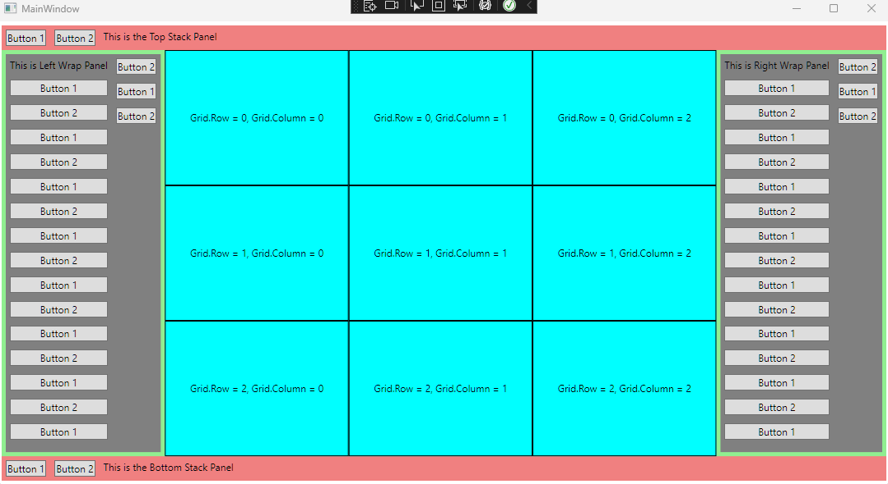

**WPF - Layouts**

Layouts are very important and fundamental concepts in WPF applications. The layout is used to arrange different UI elements in the applications. XAML provides rich built-in layouts which we can use and create flexible and responsive user interfaces.

There are five major layouts in WPF as follows,
1. Grid: Think grid as an HTML table. We can define rows and columns. We can have a row-span or column-span. It is the base layout for each WPF window by default.

2. Stack Panel: StackPanel as the name suggests stacks the child elements in a single line either horizontally or vertically. 

3. Wrap Panel: In the WrapPanel, child elements are positioned in sequential order from left to right or top to bottom on the orientation property. It is almost similar to StackPanel only difference is it does not just stack the elements in one row but wraps them into a new line if no space is left. Think of notepad and how it wraps the text accordingly. 

4. Canvas: Canvas as the name suggests we are not bound by any rows or columns or even orientations. We can free-hand the child elements and explicitly position them by coordinates relative to the canvas area.  

5. Dock Panel: In the DockPanel, you can dock the child elements to the left, right, top, bottom, or center using `DockPanel.Doc` property. The child control which can be docked to the center must be defined last and should have `LastChildFill` property set to true.

How they look:

