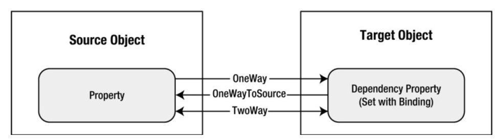

**What is data binding?**

Data binding is the process that establishes a connection between the app UI and the data it displays.Data binding is essentially the bridge between your binding target and your binding source.

Typically, each binding has four components:
- A binding target object.
- A target property.
- A binding source.
- A path to the value in the binding source to use.

>The target property must be a dependency property.

**Data Context**

When data binding is declared on XAML elements, they resolve data binding by looking at their immediate DataContext property. The data context is typically the binding source object for the binding source value path evaluation. You can override this behavior in the binding and set a specific binding source object value. If the DataContext property for the object hosting the binding isn't set, the parent element's DataContext property is checked, and so on, up until the root of the XAML object tree. In short, the data context used to resolve binding is inherited from the parent unless explicitly set on the object.

>When the DataContext property changes, all bindings that could be affected by the data context are reevaluated.

**Data Binding modes (Direction of the Data flow)**

|Name| Description|
|---|---|
|OneWay| The target property is updated when the source property changes.|
|TwoWay| The target property is updated when the source property changes, and the source property is updated when the target property changes.|
|OneTime| The target property is set initially based on the source property value. However, changes are ignored from that point onward (unless the binding is set to a completely different object or you call BindingExpression.UpdateTarget()). Usually, you’ll use this mode to reduce overhead if you know the source property won’t change.|
|OneWayToSource| Similar to OneWay but in reverse. The source property is updated when the target property changes (which might seem a little backward), but the target property is never updated.|
|Default| The type of binding depends on the target property. It’s either TwoWay (for usersettable properties, such as the TextBox.Text) or OneWay (for everything else). All bindings use this approach unless you specify otherwise.|

>To detect source changes (applicable to OneWay and TwoWay bindings), the source must implement a suitable property change notification mechanism such as `INotifyPropertyChanged`.

**What triggers source updates**

Bindings that are TwoWay or OneWayToSource listen for changes in the target property and propagate them back to the source, known as updating the source. For example, you may edit the text of a TextBox to change the underlying source value.

However, is your source value updated while you're editing the text (`PropertyChanged`) or after you finish editing the text and the control loses focus (`LostFocus`)? The `Binding.UpdateSourceTrigger` property determines what triggers the update of the source.

