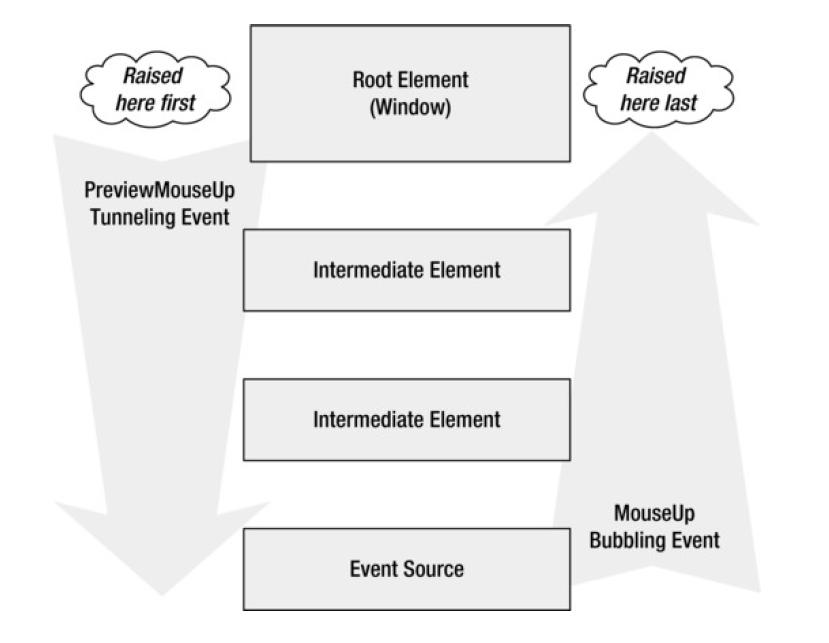

**Routed Events in WPF**

A routed event is a type of event that can invoke handlers on multiple listeners in an element tree rather than just the object that raised the event.

Routed events are events with more traveling power—they can tunnel down or bubble up the element tree and be processed by event handlers along the way. A routed event can be handled on one element (such as a label) even though it originates on another (such as an image inside that label).

There are three main routing types,
1. **Direct Event**: These are the basic common events such as the `button_click` event.
2. **Bubbling Event**: This event travels up in the Visual Tree hierarchy. Meaning, first the child elements event will be handled, and then the parent event.
3. **Tunneling Event**: This event travels down in the Visual Tree hierarchy. Meaning, first the parent elements event will be handled, and then the child event. Tunneling event are prefixed with Preview.

**Use of the Routed Events**

If you want to do multiple task simultenously then we can use Routed Events. For Example you have a inner button inside the outer button and on click on inner button you want to change the title of the window.

The following image illustrates the events flow.

